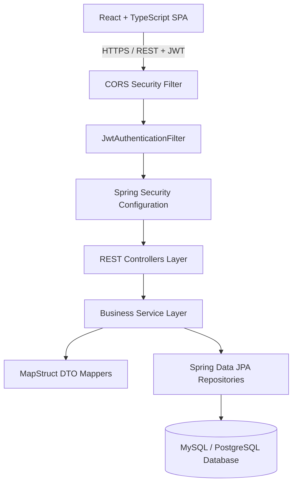
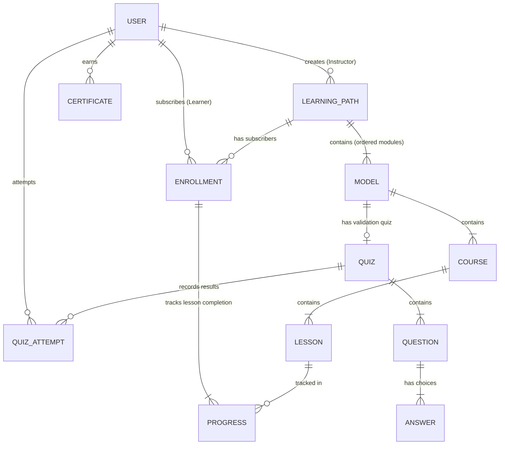

# 🎓 Learning Path Platform (Backend API & System Architecture)

[](https://spring.io/projects/spring-boot)
[](https://www.oracle.com/java/)
[](https://spring.io/projects/spring-security)
[](https://swagger.io/)
[](https://reactjs.org/)

---

## 📌 1. Executive Summary & Vision

The **Learning Path Platform** is a fullstack web application platform designed to build, manage, track, and evaluate structured online learning paths (*parcours d'apprentissage*). Unlike standard e-learning platforms that display flat lists of unorganized courses, this platform organizes content into progressive, structured sequences (**Learning Path → Modules → Courses → Lessons → Quizzes & Validation**).

### Primary Objectives
- **Formateurs / Instructors**: Create and structure pedagogical learning paths with modules, courses, rich content lessons, and multi-choice quizzes.
- **Apprenants / Learners**: Enroll in paths, track step-by-step progress (% completed per path/lesson), complete quizzes, and earn certificates.
- **Administrateurs / Admins**: Oversee users, manage application roles (`LEARNER`, `INSTRUCTOR`, `ADMIN`), moderate content, and monitor global analytics.

---

## 🏗️ 2. System Architecture & Tech Stack

### 2.1 Architectural Pattern
The system is built following a **Modular Monolith Architecture** with clear logical separation of domains (*Auth, Catalog, Enrollment, Assessment, Certification*).



### 2.2 Backend Technical Stack
| Layer | Technology | Role / Purpose |
| :--- | :--- | :--- |
| **Framework** | Spring Boot 3.5.0 (Java 21) | Core application engine & REST Web APIs |
| **Security** | Spring Security 6 + JJWT `0.12.7` | Stateless JWT Auth, RBAC, Password Hashing (BCrypt) |
| **Persistence** | Spring Data JPA + Hibernate | Object-Relational Mapping (ORM) & Database transactions |
| **Database** | MySQL / PostgreSQL | Relational database storage |
| **DTO Mapping** | MapStruct `1.6.3` | High-performance type-safe DTO <-> Entity mappings |
| **Boilerplate Reduction** | Lombok | Auto-generation of Getters, Setters, Builders, Constructors |
| **API Documentation** | SpringDoc OpenAPI 3.0 / Swagger UI | Interactive REST API documentation |

---

## 📊 3. Data Model & Entity Relationship (ER)

### 3.1 Entity Dictionary
| Entity | Key Attributes | Description |
| :--- | :--- | :--- |
| **User** | `id`, `fullName`, `email`, `password`, `role`, `createdAt` | System user account with assigned role |
| **LearningPath**| `id`, `title`, `description`, `level`, `durationHours`, `published`, `createdBy` | Complete structured learning path |
| **Model** (Module)| `id`, `title`, `orderIndex`, `learningPath` | Ordered chapter/sub-section of a learning path |
| **Course** | `id`, `title`, `description`, `orderIndex`, `model` | Course within a module |
| **Lesson** | `id`, `title`, `contentUrl`, `contentType`, `orderIndex`, `course` | Individual learning unit |
| **Enrollment** | `id`, `user`, `learningPath`, `enrolledAt`, `status` | Student enrollment record in a path |
| **Progress** | `id`, `enrollment`, `lesson`, `completed`, `completedAt` | Individual lesson completion status |
| **Quiz** | `id`, `model`, `title`, `passingScore` | Validation evaluation for a module |
| **Question** | `id`, `quiz`, `text`, `type` | Quiz question |
| **Answer** | `id`, `question`, `text`, `isCorrect` | Answer options for a question |
| **QuizAttempt** | `id`, `quiz`, `user`, `score`, `passed`, `attemptedAt` | Student attempt and result for a quiz |
| **Certificate** | `id`, `user`, `learningPath`, `issuedAt`, `certificateUrl` | Certificate issued upon path completion |

### 3.2 ER Diagram (Mermaid)



---

## 🔒 4. Security Architecture & Role-Based Access Control (RBAC)

### 4.1 Authentication Flow
Authentication is **stateless** using JSON Web Tokens (JWT):
1. **Client** sends credentials to `POST /api/auth/login`.
2. **AuthenticationService** verifies credentials using `BCryptPasswordEncoder` and `AuthenticationManager`.
3. Server returns an **Access Token** (24h validity) + **Refresh Token** (7 days validity) + User Profile.
4. Client attaches `Authorization: Bearer <token>` header to all subsequent HTTP requests.
5. `JwtAuthenticationFilter` validates token signature, extracts user details & roles, and populates `SecurityContextHolder`.

### 4.2 Role Permission Matrix (RBAC)

| Resource / Endpoint | Public | LEARNER | INSTRUCTOR | ADMIN |
| :--- | :---: | :---: | :---: | :---: |
| Auth (`/api/auth/register`, `/api/auth/login`) | ✅ | ✅ | ✅ | ✅ |
| Swagger Docs (`/swagger-ui/**`, `/v3/api-docs/**`) | ✅ | ✅ | ✅ | ✅ |
| Browse Learning Paths (`GET /api/v1/learning-paths/**`) | ✅ | ✅ | ✅ | ✅ |
| Create/Edit Paths (`POST/PUT /api/v1/learning-paths/**`) | ❌ | ❌ | ✅ | ✅ |
| Delete Paths (`DELETE /api/v1/learning-paths/**`) | ❌ | ❌ | ❌ | ✅ |
| Enroll & View My Progress (`/api/v1/enrollments/**`, `/me`) | ❌ | ✅ | ✅ | ✅ |
| Take Quizzes & Submit Attempts (`/api/quizzes/**`, `/api/quiz-attempts/**`) | ❌ | ✅ | ✅ | ✅ |
| View Certificates (`/api/certificates/**`) | ❌ | ✅ | ✅ | ✅ |
| User Management (`/api/v1/users/**`) | ❌ | ❌ | ❌ | ✅ |

---

## 🌐 5. REST API Specifications

### 5.1 Authentication Endpoints (`/api/auth`)
| Method | Endpoint | Description | Access |
| :--- | :--- | :--- | :--- |
| `POST` | `/api/auth/register` | Register a new user account | Public |
| `POST` | `/api/auth/login` | Authenticate user & return JWT tokens | Public |
| `POST` | `/api/auth/refresh` | Issue new access token via refresh token | Authenticated |
| `GET` | `/api/auth/me` | Fetch authenticated user profile | Authenticated |

### 5.2 Content & Learning Paths (`/api/v1/...`)
| Method | Endpoint | Description | Access |
| :--- | :--- | :--- | :--- |
| `GET` | `/api/v1/learning-paths` | Get list of all published learning paths | Public |
| `GET` | `/api/v1/learning-paths/{id}` | Get detailed path (modules, courses) | Public |
| `POST` | `/api/v1/learning-paths` | Create a new learning path | Instructor / Admin |
| `PUT` | `/api/v1/learning-paths/{id}` | Update existing learning path | Instructor / Admin |
| `DELETE`| `/api/v1/learning-paths/{id}` | Delete learning path | Admin |
| `POST` | `/api/v1/models` | Create a module in a path | Instructor / Admin |
| `POST` | `/api/v1/courses` | Create a course in a module | Instructor / Admin |
| `POST` | `/api/v1/lessons` | Create a lesson in a course | Instructor / Admin |

### 5.3 Enrollments & Progress (`/api/v1/...`)
| Method | Endpoint | Description | Access |
| :--- | :--- | :--- | :--- |
| `POST` | `/api/v1/enrollments` | Enroll current user in a learning path | Learner / Admin |
| `GET` | `/api/v1/enrollments` | Get user enrollments and progress | Learner / Admin |
| `POST` | `/api/v1/progress` | Mark lesson as completed | Learner / Admin |

### 5.4 Quizzes & Certificates (`/api/...`)
| Method | Endpoint | Description | Access |
| :--- | :--- | :--- | :--- |
| `GET` | `/api/quizzes/model/{modelId}`| Get validation quiz for a module | Learner / Admin |
| `POST` | `/api/quiz-attempts/submit` | Submit answers for auto-grading | Learner / Admin |
| `GET` | `/api/certificates/user/{userId}`| Get earned completion certificates | Learner / Admin |

---

## 💻 6. Local Setup & Execution Guide

### Prerequisites
- **JDK 21** or later installed
- **Maven 3.9+** installed
- **MySQL** or **PostgreSQL** database instance running

### Configuration
Update `src/main/resources/application.properties` with your database credentials:

```properties
spring.application.name=e-learning

# Database Configuration
spring.datasource.url=jdbc:mysql://localhost:3306/elearning_db?createDatabaseIfNotExist=true&useSSL=false
spring.datasource.username=root
spring.datasource.password=your_password
spring.jpa.hibernate.ddl-auto=update
spring.jpa.show-sql=true

# JWT Security Configuration
application.security.jwt.secret-key=404E635266556A586E3272357538782F413F4428472B4B6250645367566B5970
application.security.jwt.expiration=86400000
application.security.jwt.refresh-token.expiration=604800000
```

### Build & Run Commands
```bash
# Clone repository
git clone https://github.com/mohamed31123/e-learning.git
cd e-learning

# Compile and test
mvn clean test-compile

# Run application
mvn spring-boot:run
```

Once running, access the interactive Swagger API documentation at:
👉 **`http://localhost:8080/swagger-ui.html`**

---

## 🎨 7. Frontend Integration Guidelines (React + TypeScript)

The backend exposes CORS support configured in `CorsConfig.java` allowing `http://localhost:5173` (Vite) and `http://localhost:3000` (Create React App).

### Recommended Axios Client Setup
```typescript
import axios from 'axios';

const api = axios.create({
  baseURL: 'http://localhost:8080',
  headers: {
    'Content-Type': 'application/json',
  },
});

// Interceptor to attach Bearer token automatically
api.interceptors.request.use((config) => {
  const token = localStorage.getItem('accessToken');
  if (token) {
    config.headers.Authorization = `Bearer ${token}`;
  }
  return config;
});

export default api;
```

---

## 👨‍💻 Author
**Mohamed** – *Software Engineer / Fullstack Developer*
